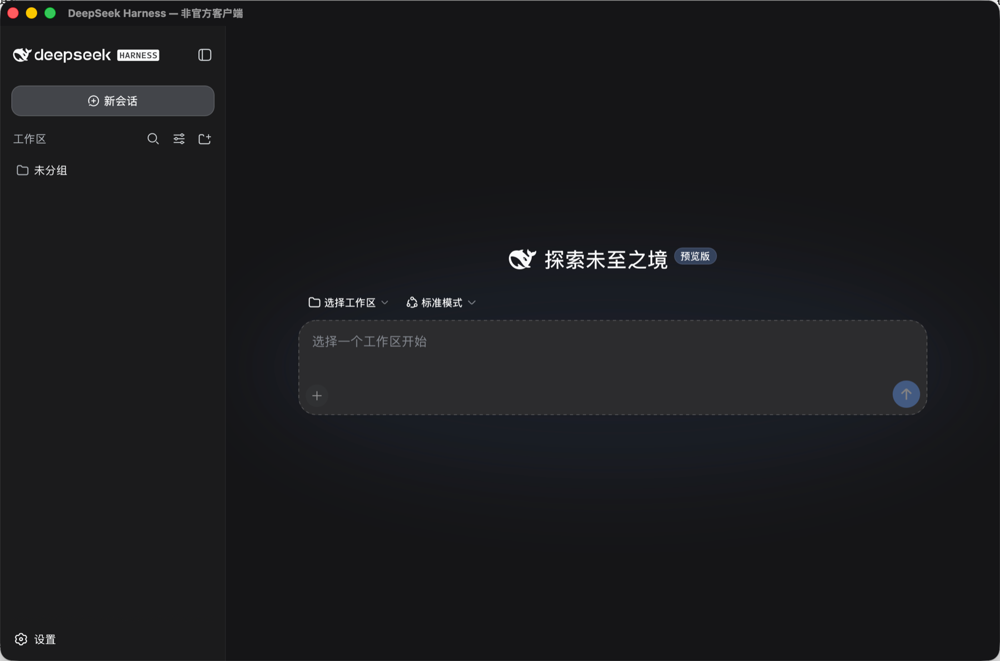

<div align="center">
  <p><a href="README.md">简体中文</a> · <strong>English</strong></p>
  
  <h1>DeepSeek Harness for macOS</h1>
  <p><strong>The full power of Harness, packaged as a Mac app you can simply open and use.</strong></p>
  <p>No Node.js setup, terminal commands, or runtime maintenance. Download, launch, and get to work.</p>

  <p>
    <a href="https://github.com/mapan0424/deepseek-harness-desktop/releases/latest"></a>
    
    
    
    
    <a href="LICENSE"></a>
  </p>

  <p>
    <a href="https://github.com/mapan0424/deepseek-harness-desktop/releases/latest"><strong>Download the latest release</strong></a>
    · <a href="https://github.com/deepseek-ai/deepseek-harness">Upstream Harness</a>
    · <a href="https://github.com/mapan0424/deepseek-harness-desktop/issues">Issues & ideas</a>
  </p>
</div>

<p align="center">
  
</p>

<p align="center"><sub>One app containing Harness, official Node.js, and native dependencies for your Mac architecture.</sub></p>

## ✨ Why use it

### Ready out of the box

You do not need to install or maintain:

- Node.js
- npm or pnpm
- Homebrew
- the DeepSeek Harness CLI
- extra runtimes or first-launch downloads

Download the right DMG, move the app to Applications, and launch it. Every release carries a pinned, self-contained runtime, unaffected by your global Node version, `PATH`, or package manager state.

### The complete Harness experience

This is not a reduced chat wrapper. It hosts the DeepSeek Harness Web UI directly and preserves the capabilities that make Harness useful:

- multi-turn sessions and streaming responses
- Markdown and code rendering
- workspaces and context management
- tool calls and approval flows
- model, credential, and plugin configuration
- an experience that can evolve with upstream Harness

The desktop layer does not reinvent Harness. It makes Harness feel at home on macOS.

### A proper Mac app

- a dedicated window and Dock entry
- automatic startup of the local Harness service
- automatic selection of an available port
- direct entry into the workspace once startup completes
- automatic cleanup of background processes when the app quits
- the macOS system WebView instead of a bundled Chromium runtime
- no terminal window or manually managed local server

### Local-first by design

The Harness service listens only on `127.0.0.1`. Sessions, settings, workspaces, and credentials remain under local Harness management, and the desktop app does not expose the UI service to your local network.

Where model requests go—and how providers process them—depends on the model service you configure in Harness.

### Built for more useful machines

Apple Silicon, Intel Mac, and Windows x64 each receive dedicated installers, Node.js runtimes, and native dependencies. Keeping architectures separate avoids unnecessary size and compatibility compromises.

- minimum macOS version: **12.7.6**
- Apple Silicon: `arm64`
- Intel Mac: `x86_64`
- Windows 10 / 11: `x86_64`
- compatibility work across system WebViews and native modules

The build pipeline verifies Markdown behavior, native architecture, and platform targets so older Intel Macs and mainstream Windows PCs can keep a complete Harness experience.

## 🚀 Download and install

Open [GitHub Releases](https://github.com/mapan0424/deepseek-harness-desktop/releases/latest) and choose the package for your platform and processor:

| Platform | Package |
| --- | --- |
| macOS Apple Silicon (M1, M2, M3, M4, and later) | `DeepSeek.Harness_*_macos_arm64.dmg` |
| macOS Intel | `DeepSeek.Harness_*_macos_x86_64.dmg` |
| Windows 10 / 11 x64 (recommended) | `DeepSeek.Harness_*_windows_x86_64-setup.exe` |
| Windows x64 enterprise deployment | `DeepSeek.Harness_*_windows_x86_64.msi` |

### macOS

1. Open the DMG.
2. Drag `DeepSeek Harness.app` into Applications.
3. Launch the app and configure your preferred model or API credentials in Harness.

If macOS blocks the first launch, verify that the file came from this repository's Release page, then run:

```bash
xattr -dr com.apple.quarantine "/Applications/DeepSeek Harness.app"
```

### Windows

1. Download and run `setup.exe`.
2. Open DeepSeek Harness from the Start menu after installation.
3. Configure your preferred model or API credentials in Harness.

MSI is primarily intended for enterprise or managed deployment. Windows 10 and 11 normally include the required Microsoft Edge WebView2 Runtime.

## 🧭 How it works

```text
DeepSeek Harness.app
├── Native macOS window
├── Rust / Tauri desktop layer
│   ├── Starts the embedded runtime
│   ├── Selects a local port
│   ├── Waits for the service to become ready
│   └── Manages process lifecycle
├── Official Node.js
├── DeepSeek Harness
└── macOS system WebView
    └── Harness Web UI
```

Production builds run one embedded runtime directly from App Resources. Nothing is downloaded or unpacked into a second runtime copy on first launch. The desktop layer owns the environment and lifecycle; Harness owns agents, sessions, models, tools, and plugins.

## 🌊 Vision

The goal is not merely to make Harness launchable. It is to build a dependable macOS home for Harness:

- **Lower the barrier:** make Harness useful without requiring knowledge of the Node.js toolchain.
- **Stay faithful upstream:** preserve Harness capabilities, interaction patterns, and plugin ecosystem.
- **Respect the platform:** progressively improve menus, shortcuts, notifications, file interactions, and updates.
- **Keep valuable hardware useful:** support older Intel Macs and macOS releases where practical.
- **Remain local-first:** keep runtimes, processes, and data boundaries understandable and under user control.
- **Ship reproducibly:** pin and validate runtimes, architectures, and dependencies for a consistent release experience.

If you want Harness to become a daily tool you can launch from the Dock, try it, share feedback, and help shape what comes next.

## 🛠️ Development

### Requirements

- macOS
- Node.js
- pnpm
- Rust toolchain
- Xcode Command Line Tools

### Run locally

```bash
pnpm install
pnpm tauri dev
```

### Build for Apple Silicon

```bash
pnpm build:macos
```

Output:

```text
src-tauri/target/release/bundle/dmg/DeepSeek Harness_<version>_aarch64.dmg
```

### Build for Intel Mac

```bash
pnpm build:macos:intel
```

Output:

```text
src-tauri/target/x86_64-apple-darwin/release/bundle/dmg/DeepSeek Harness_<version>_x64.dmg
```

### Build for Windows x64

Windows installers are built on a native Windows GitHub Actions runner:

```text
Actions → Build Windows x64 → Run workflow
```

They can also be built on a Windows x64 development machine:

```bash
pnpm build:windows
```

The build pipeline automatically:

- downloads and verifies official Node.js for the target architecture
- installs a pinned Harness production dependency closure
- retains native modules for the selected architecture
- applies macOS 12.7.6 WebKit compatibility handling
- verifies Markdown behavior, Mach-O architecture, and deployment targets
- generates npm and Rust/Tauri third-party license reports
- ensures the app contains one runtime without a first-launch cache copy

## 🤝 Contributing

Use [Issues](https://github.com/mapan0424/deepseek-harness-desktop/issues) to report or discuss:

- macOS or Windows compatibility problems
- Intel, Apple Silicon, or Windows x64 feedback
- desktop experience improvements
- build and distribution work
- upgrades to newer Harness releases

When reporting a problem, include your macOS version, processor architecture, and any error information that is safe to share. Never upload API keys or credentials.

## 📄 License and notice

The desktop shell is available under the [MIT License](LICENSE). DeepSeek Harness and bundled components retain their respective copyrights and licenses. See [`src-tauri/legal/THIRD_PARTY_NOTICES.md`](src-tauri/legal/THIRD_PARTY_NOTICES.md) for details.

This is an independent community project. It is not an official DeepSeek product and does not imply sponsorship, endorsement, or affiliation. “DeepSeek” and “DeepSeek Harness” are used only to identify the compatible upstream project.

## 🔗 Related projects

- [DeepSeek Harness](https://github.com/deepseek-ai/deepseek-harness)
- [DeepSeek Harness website](https://deepseek.com/harness)

## 🌐 Friendly links

- [LINUX DO Community](https://linux.do)
